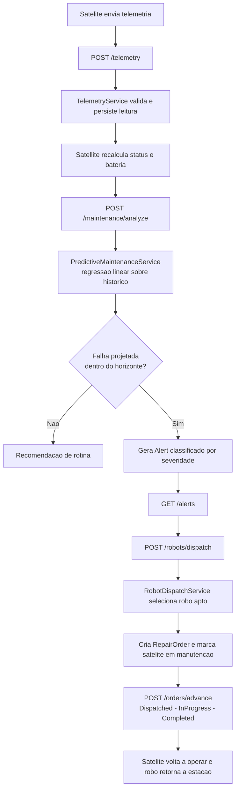

# REORBITA — Plataforma de Inteligência Orbital

API REST de manutenção orbital preditiva construída em Java 21 com Spring Boot 3, Spring Data JPA e banco H2. O projeto materializa, em software, os três pilares do ecossistema REORBITA proposto para a Global Solution.

## Motivação

Mais de 60% dos satélites lançados na última década ainda estarão em órbita em 2035, mas a maioria deixará de funcionar muito antes disso — por falhas pontuais, baterias degradadas ou combustível esgotado. Cada satélite é um equipamento de milhões de dólares que vira lixo porque ninguém pode subir lá para apertar um parafuso. Construímos um cemitério a 400 km de altura.

A REORBITA transforma esse cemitério em uma oficina. Esta API representa a camada de software que sustenta a operação:

- **Plataforma de Inteligência Orbital** — cada satélite parceiro vira um gêmeo digital alimentado por telemetria histórica. Um motor de manutenção preditiva analisa a degradação da bateria por regressão linear sobre o histórico e antecipa a falha em dias, gerando alertas classificados por severidade antes que o satélite morra.
- **Frota de robôs modulares de reparo** — uma família de veículos orbitais especializados (reabastecimento, troca de módulos, correção de trajetória e captura de detritos) operando a partir de estações-mãe. A API coordena o despacho do robô certo para cada tarefa e controla o ciclo de vida da intervenção.
- **Protocolo Orbit-Ready** — o padrão aberto de acoplamento universal ("USB-C para satélites"). O domínio distingue satélites `Orbit-Ready` (reparáveis, baixa complexidade) de satélites `Legacy` (não padronizados, alta complexidade), e essa distinção dirige polimorficamente o custo e a duração estimada de cada missão.

## Como a solução se integra ao problema

| Pilar REORBITA | Implementação na API |
| --- | --- |
| Inteligência Orbital (manutenção preditiva) | `PredictiveMaintenanceServiceImpl` projeta a falha de bateria e emite alertas; histórico de telemetria com `LocalDateTime` |
| Frota de robôs modulares | Hierarquia `RepairRobot` e `RobotDispatchServiceImpl` selecionam o robô apto e gerenciam a ordem de reparo |
| Protocolo Orbit-Ready | `OrbitReadySatellite` vs `LegacySatellite` definem polimorficamente capacidade e complexidade de reparo |

## Arquitetura

Organização em camadas, com separação entre domínio, aplicação, infraestrutura de acesso a dados e camada web.

```
src/main/java/com/reorbita/
├── domain/
│   ├── entity/      Satellite (abstrata) + OrbitReady/Legacy, Sensor, TelemetryReading,
│   │                Alert, RepairRobot (abstrata) + 4 robôs, MotherStation, RepairOrder
│   ├── vo/          OrbitalPosition, BatteryHealth (@Embeddable, imutáveis, com validação)
│   ├── enums/       SatelliteStatus, AlertSeverity, SensorType, RepairKind, RepairStatus
│   └── exception/   DomainException (base) e exceções específicas
├── repository/      Interfaces Spring Data JPA (injeção de dependência)
├── application/
│   ├── dto/         Records de transferência de entrada e saída
│   ├── mapper/      DomainMapper (conversão estática entidade -> DTO)
│   └── service/     Interfaces de negócio + impl/ (preditiva, telemetria, alertas, despacho)
├── web/
│   ├── controller/  Satellite, Telemetry, Maintenance, Alert, Robot
│   └── GlobalExceptionHandler  (respostas de erro padronizadas)
└── config/          DataInitializer (seed) e OpenApiConfig
```

## Atendimento aos requisitos técnicos

| Requisito | Onde está |
| --- | --- |
| Classes públicas, estáticas e privadas | Entidades públicas; `DomainMapper` com métodos estáticos; campos e métodos privados nas entidades |
| Herança e polimorfismo | `Satellite` → `OrbitReadySatellite`/`LegacySatellite`; `RepairRobot` → 4 robôs especializados |
| Classes abstratas | `Satellite`, `RepairRobot`, `DomainException` |
| Interfaces e injeção de dependência | Interfaces de serviço e repositórios injetados via construtor pelo Spring |
| Métodos e manipulação de datas | `ageInYears`, `timeInOrbit`, janelas de histórico e projeção de falha com `LocalDateTime` |
| Tratamento de exceções | Exceções de domínio específicas + `GlobalExceptionHandler` (`@RestControllerAdvice`) |
| Estruturas auxiliares VO/DTO | `@Embeddable` imutáveis e DTOs como `record` |
| Conexão com banco de dados | Spring Data JPA + H2, herança SINGLE_TABLE, value objects embarcados |
| WebService/API | API REST com cinco controladores e documentação Swagger (OpenAPI) |

## Tecnologias

- Java 21
- Spring Boot 3.3 (Spring Web, Spring Data JPA, Bean Validation)
- Banco H2 em memória
- springdoc-openapi (Swagger UI)
- Maven (com Maven Wrapper incluído)

## Como executar

Pré-requisito: JDK 21 ou superior.

Pelo terminal, com o Maven Wrapper:

```bash
./mvnw spring-boot:run
```

No Windows:

```bash
mvnw.cmd spring-boot:run
```

Ou abra a pasta no IntelliJ IDEA e rode a classe `ReorbitaApplication`.

A aplicação sobe em `http://localhost:8080`. O banco H2 em memória é criado e populado automaticamente pelo seed a cada inicialização. Recursos úteis:

```
http://localhost:8080/swagger-ui.html     documentação interativa da API
http://localhost:8080/h2-console           console do banco (JDBC URL: jdbc:h2:mem:reorbita)
```

## Principais endpoints

| Método | Rota | Descrição |
| --- | --- | --- |
| GET | `/api/satellites` | Lista todos os satélites |
| GET | `/api/satellites/{id}` | Detalha um satélite |
| POST | `/api/satellites` | Registra um novo satélite |
| POST | `/api/satellites/{id}/telemetry` | Ingere uma leitura de telemetria |
| GET | `/api/satellites/{id}/telemetry?days=N` | Histórico de telemetria |
| POST | `/api/satellites/{id}/maintenance/analyze` | Executa a análise preditiva e gera alertas |
| GET | `/api/alerts` | Lista alertas ativos |
| POST | `/api/alerts/{id}/acknowledge` | Reconhece um alerta |
| GET | `/api/robots/fleet` | Lista estações-mãe e robôs |
| POST | `/api/robots/dispatch` | Despacha um robô para uma intervenção |
| POST | `/api/robots/orders/{id}/advance` | Avança o ciclo de vida da ordem de reparo |

## Diagrama de fluxo

Fluxo principal — da telemetria à intervenção da frota:



Diagrama detalhado das entidades e do ciclo de vida em [docs/DIAGRAMA.md](docs/DIAGRAMA.md).

## Evidências de execução

Capturas reais de requisição e resposta de todos os endpoints, incluindo os casos de erro, em [docs/EVIDENCIAS.md](docs/EVIDENCIAS.md).
