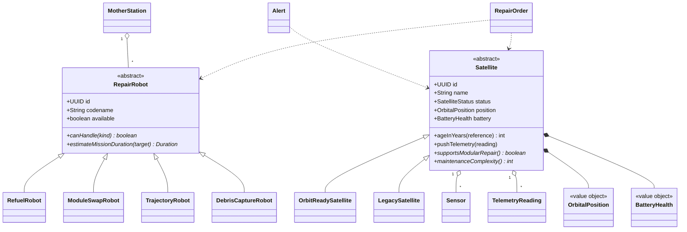
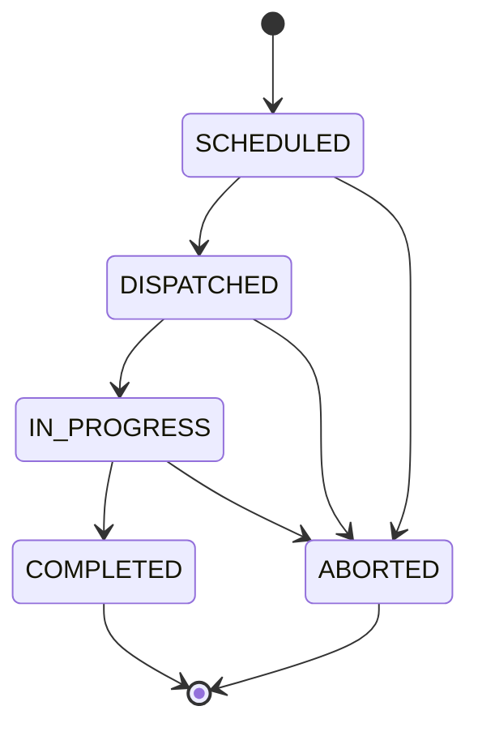
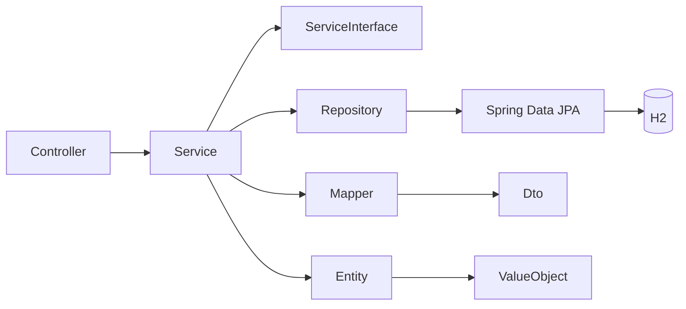

# Diagramas — REORBITA

## Modelo de domínio

```mermaid
classDiagram
    class Satellite {
        <<abstract>>
        +UUID id
        +String name
        +SatelliteStatus status
        +OrbitalPosition position
        +BatteryHealth battery
        +ageInYears(reference) int
        +pushTelemetry(reading)
        +supportsModularRepair()* boolean
        +maintenanceComplexity()* int
    }
    class OrbitReadySatellite
    class LegacySatellite
    class RepairRobot {
        <<abstract>>
        +UUID id
        +String codename
        +boolean available
        +canHandle(kind)* boolean
        +estimateMissionDuration(target)* Duration
    }
    class RefuelRobot
    class ModuleSwapRobot
    class TrajectoryRobot
    class DebrisCaptureRobot
    class MotherStation
    class Sensor
    class TelemetryReading
    class Alert
    class RepairOrder
    class OrbitalPosition {
        <<value object>>
    }
    class BatteryHealth {
        <<value object>>
    }

    Satellite <|-- OrbitReadySatellite
    Satellite <|-- LegacySatellite
    RepairRobot <|-- RefuelRobot
    RepairRobot <|-- ModuleSwapRobot
    RepairRobot <|-- TrajectoryRobot
    RepairRobot <|-- DebrisCaptureRobot
    Satellite "1" o-- "*" Sensor
    Satellite "1" o-- "*" TelemetryReading
    Satellite *-- OrbitalPosition
    Satellite *-- BatteryHealth
    MotherStation "1" o-- "*" RepairRobot
    Alert ..> Satellite
    RepairOrder ..> Satellite
    RepairOrder ..> RepairRobot
```

## Ciclo de vida da ordem de reparo

```mermaid
stateDiagram-v2
    [*] --> SCHEDULED
    SCHEDULED --> DISPATCHED
    DISPATCHED --> IN_PROGRESS
    IN_PROGRESS --> COMPLETED
    SCHEDULED --> ABORTED
    DISPATCHED --> ABORTED
    IN_PROGRESS --> ABORTED
    COMPLETED --> [*]
    ABORTED --> [*]
```

## Camadas e dependências

```mermaid
flowchart LR
    Controller --> Service
    Service --> ServiceInterface
    Service --> Repository
    Repository --> JPA[Spring Data JPA]
    JPA --> H2[(H2)]
    Service --> Mapper
    Mapper --> Dto
    Service --> Entity
    Entity --> ValueObject
```
